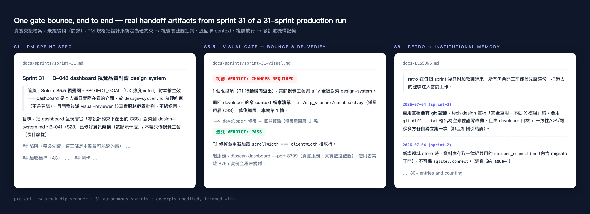
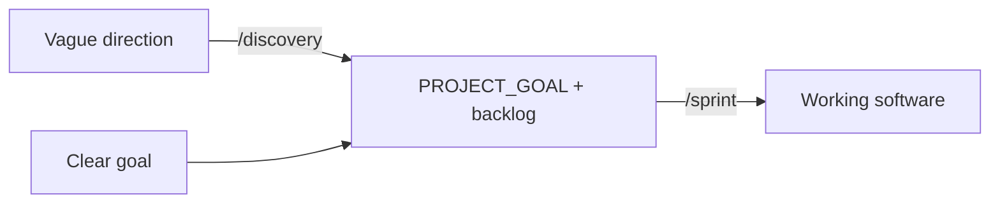
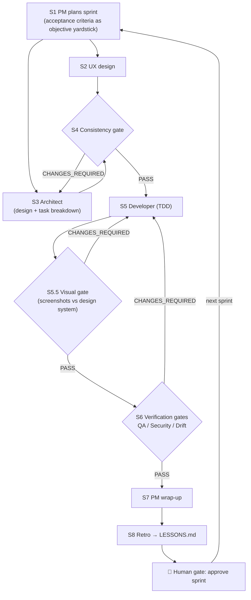

# dev-factory

**A reusable multi-agent SDLC framework for Claude Code** — it orchestrates a full software team (PM → UX → Architect → Developer → QA → Security) as autonomous agents with quality gates, file-based handoffs, and a self-learning retro loop.

Battle-tested across **30+ autonomous sprints** on a real production project, with lessons from every retro folded back into the framework.

[繁體中文版 README](README.zh-TW.md)

---

## Why

Coding agents are great at *writing code* and bad at *being a team*: they skip design, drift from architecture, and never learn from their mistakes. dev-factory adds the missing governance layer:

- **Role separation** — 14 specialized subagents, each with one job and a mandatory written deliverable
- **Quality gates** — consistency, visual, QA, security, and drift gates that *automatically bounce work back* when it fails, with loop caps so agents never spin forever
- **File-based handoffs** — subagents share no memory; `docs/` is the single source of truth, so every decision is traceable from backlog item → sprint → task → acceptance criteria
- **Self-learning** — every sprint ends with a retro; lessons accumulate automatically in `LESSONS.md` (read by all roles next sprint), while process changes require human approval — so the framework improves without degrading its own guardrails

## What a gate bounce looks like in practice

Real, unedited handoff artifacts from sprint 31 of a 31-sprint production run — the PM spec declares the design system a hard constraint, the visual gate screenshots the live app, bounces one blocking issue back to the developer with narrow context, re-verifies, and passes; the retro's lessons feed every role's next sprint:



## Two pipelines



**`/discovery`** (optional front-end): you give a direction; agents diverge into 3–5 concepts, adversarially validate each against evidence (desirability / feasibility / viability / validatability rubric — no vibes allowed), and converge into a project goal you approve.

**`/sprint`** (build): the orchestrator runs one sprint per cycle:



Gate failures bounce back automatically with narrow context (only the flagged files) to save tokens. You are only interrupted at sprint wrap-up or when a loop cap is hit.

## Cost scales with risk

Two orthogonal knobs, asked once per project:

| Knob | Options | What it controls |
|------|---------|------------------|
| **Governance profile** | `lean` / `standard` / `max` | How many gates run — `lean` merges verification into a single reviewer (~5 handoffs), `max` splits QA/security/drift into specialist passes. Safety rails (TDD, no-pass on High security findings, loop caps) survive every profile. |
| **UX intensity** | `light` / `full` | `full` makes `design-system.md` a *hard constraint* (agents may only use existing tokens) and adds the S5.5 visual gate — the only role in the pipeline that actually *sees* the rendered product. Taste = constraints + feedback, not "please make it pretty" in a prompt. |

## Cost observability & self-learning routing: token-lens (optional)

Everyone runs on AI; almost nobody manages token ROI. dev-factory ships an **optional** observability-and-governance layer, `token-lens`, mounted outside the flow — **observability separated from execution, changes gated on human approval**, zero extra tokens on non-AI projects:

| Module | Mount | What it does | Token cost |
|--------|-------|--------------|-----------|
| **Ledger** | retro (conditional) | Parses session logs; attributes cost + a quality proxy (tool-error rate) to project / model / role | Parsing is free; an agent only interprets when a number breaches a threshold |
| **Router** | architect (conditional) | Routes work to a model tier by task × criticality; a versioned policy file is the source of truth, cold cells fall back to a Radar prior | Skipped entirely on non-LLM work |
| **Radar** | called by Router | Pulls model/pricing docs + cross-model intel (price/quality/speed) so routing uses current model ids and objective priors | curl script, zero tokens |
| **retro_optimize** (learning engine) | retro (conditional) | Turns each sprint's cost×quality into champion/challenger promotion proposals (Pareto rule + criticality hard-floor); **promotions stay human-approved — the engine never edits the policy itself** | Parsing free; interpret only when triggered |

**The self-learning loop:** Radar intel (read-only) → recommendation table (decision SoR) → Router dispatch by task × criticality → sprint run → retro evaluation (three triggers: quality↑ upgrade / cost↑ downgrade / Radar opportunity) → Pareto + hard-floor → **human gate** ↺ write back to the table. Structurally it's the champion/challenger + canary + holdout loop an ad platform runs to optimize creatives/bids — with model selection as the thing being optimized. Downgrade proposals must carry quality-proxy evidence: **cheaper only if quality holds**.

> What ships here under `vendor/token-lens/` is a **runtime snapshot** — the observability + routing scripts seeded into each project; see `vendor/token-lens/UPSTREAM.md`. Edit it via the upstream working copy and refresh with `sync-from-upstream.sh`, not in place.

## Quick start

```bash
# 1. Install into your project
cd /path/to/your-project
/path/to/dev-factory/install.sh

# 2a. Know what to build → fill in docs/PROJECT_GOAL.md + docs/backlog.md, run /sprint
# 2b. Only have a direction → fill in docs/DIRECTION.md, run /discovery first

# 3. Open Claude Code in the project
#    Shift+Tab to accept-edits mode (so agents work continuously)

# 4. Kick off:
#    "Read CLAUDE.md and start the autonomous sprint workflow. Run one sprint, then summarize."
```

Once a single sprint runs clean (check that `docs/` handoff files were actually produced), chain sprints with `/loop /sprint`.

### Prerequisite (recommended): superpowers

Per-role discipline (TDD, systematic debugging, plan writing) is delegated to the open-source [superpowers](https://github.com/obra/superpowers) plugin — dev-factory stays focused on governance and orchestration. Install once at user level:

```
/plugin marketplace add obra/superpowers-marketplace
/plugin install superpowers@superpowers-marketplace
```

Agents fall back to embedded rules when it's absent.

## Install modes

- **Project-level (default)** — copies into `<project>/.claude/`; the project is self-contained and git-committable. Re-run install to upgrade.
- **User-level** — `install.sh --user` installs to `~/.claude/` shared across projects; seed each project with `install.sh --seed-only <path>`.
- **Upgrade protection** — install records file hashes (`.dev-factory-manifest`); re-running skips anything you've locally customized and warns, unless `--force`.

## What's inside

```
dev-factory/
├── agents/           14 role subagents (11 build + 3 discovery: explorer/critic/shaper)
├── skills/sprint/    build orchestrator (/sprint playbook)
├── skills/discovery/ front-end orchestrator (/discovery playbook)
├── templates/        CLAUDE.md contract + goal/backlog/lessons/ADR/design-system seeds
├── vendor/ui-ux-pro-max/  vendored design database + generator scripts (MIT; seeded into each project's .claude/uipro/ for the one-time S0 tailored-preset step)
├── vendor/token-lens/     optional cost-observability + self-learning routing layer (ledger/quality/radar/router/retro_optimize + policy/intel; runtime snapshot seeded into .claude/token-lens/; see UPSTREAM.md)
├── docs/PIPELINE.md  full flow diagrams and design rationale
└── install.sh        installer
```

## Design principles

- **Acceptance criteria as the objective yardstick** — the PM writes requirements as testable conditions in S1, so verification gates judge against facts, not feelings.
- **Security shifts left** — threat modeling is seeded at architecture time (S3); the security gate verifies coverage rather than patching at the end.
- **ADR ledger** — architecture decisions are recorded so the drift gate can mechanically compare reality against intent.
- **Files are the meeting minutes** — subagents share no memory; every handoff is a file, every decision is auditable.
- **Self-learning with risk tiers** — lessons accumulate automatically (safe); changes to role instructions or process are only *proposed* and require human approval (framework can't degrade its own guardrails).

Full rationale and per-stage tables: [docs/PIPELINE.md](docs/PIPELINE.md).

## Customization

- **Save time/tokens** → adjust the governance profile first (it's the cost master-knob; no agent edits needed)
- **Different visual taste** → replace `docs/design/design-system.md` wholesale (default is a Stripe-flavored system; keep the three section headings agents anchor on)
- **Don't need a role** → delete its `agents/*.md` and remove the step from `skills/sprint/SKILL.md`
- **Different models per role** → edit `model:` in each agent's frontmatter
- **More/less autonomy** → edit the "autonomy boundary" section in `templates/CLAUDE.md`

### Upgrading existing projects to a tailored preset

install.sh never overwrites an existing `docs/design/design-system.md`. Two upgrade paths:

1. **Anti-slop rules only**: manually copy rules 11–14 (emoji icons, hover layout shift, AI purple-pink gradients, cursor: pointer) from `templates/design-system.md` into your project's design-system.md.
2. **Tailored preset**: reset your project's design-system.md to the factory template (with the first-line `<!-- dev-factory-default-preset -->` marker); the next full-intensity sprint's S0 step regenerates it from PROJECT_GOAL.

## Acknowledgements

Per-role execution discipline is delegated to [superpowers](https://github.com/obra/superpowers) by @obra (MIT) as an **optional, separately-installed dependency** — no superpowers code is bundled in this repo. dev-factory itself is the governance/orchestration layer on top.

The design database and generator scripts behind the S0 tailored-preset step come from [ui-ux-pro-max-skill](https://github.com/nextlevelbuilder/ui-ux-pro-max-skill) (MIT) — this part **is vendored** under `vendor/ui-ux-pro-max/` (with its LICENSE and source/version notes; see that folder's README).

## License

[MIT](LICENSE)
